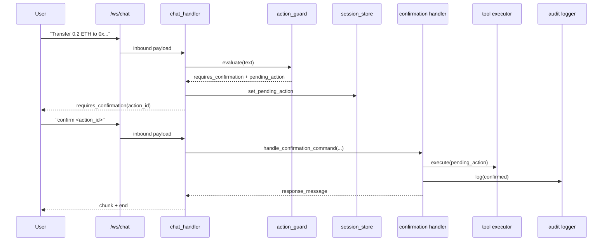

# Veronica — Empathetic AI Agent Platform

Veronica is a modular AI assistant platform inspired by J.A.R.V.I.S., with a product goal centered on **empathetic interaction + controlled automation**.

This repository currently contains a production-oriented prototype with:
- FastAPI backend with WebSocket streaming chat.
- LangChain-based orchestrator.
- Tool execution policy with explicit confirmation gates.
- Local JSONL audit trail for sensitive actions.
- Long-term memory primitives via ChromaDB.
- Voice and vision extension points.
- Initial blockchain read/simulated-transfer capabilities.

---

## 1) Project Maturity Snapshot

> **Current stage:** Professional prototype / early platform hardening.

### What is already strong
- Clear modular backend boundaries (`agents`, `api`, `policy`, `memory`, `tools`, etc.).
- Confirmation-first safety model for side-effect actions.
- Typed API contracts and regression tests for critical flows.
- ADR-backed Phase 1 foundation work.

### What is still pending for production-grade release
- Authentication/authorization and multi-tenant isolation.
- Real service integrations (email/home/calendar) beyond simulation.
- Secure blockchain signer pipeline (current transfer flow is simulation-only).
- CI/CD, observability stack, and deployment runbooks.

---

## 2) System Architecture

```mermaid
flowchart LR
  User[User: Web / Voice] --> FE[Next.js Frontend]
  FE -->|WebSocket| API[FastAPI API Layer]
  API --> Handler[Chat Protocol Handler]
  Handler --> Policy[Action Guard + Confirmation]
  Handler --> Orch[Agent Orchestrator]
  Orch --> LLM[LLM Provider Factory\nOpenAI / Anthropic]
  Orch --> Memory[(ChromaDB Memory)]
  Orch --> Tools[Tool Registry]
  Policy --> Audit[(Audit JSONL)]
  Tools --> IoT[IoT / Home Tools (simulated)]
  Tools --> Email[Email Tool (simulated)]
  Tools --> Chain[Blockchain Service]
```

### Runtime sequence for sensitive command



---

## 3) Repository Structure

```text
Veronica/
├── backend/
│   ├── app/
│   │   ├── agents/        # Orchestrator and execution pipeline
│   │   ├── api/           # FastAPI routes, middleware, websocket protocol handler
│   │   ├── blockchain/    # Blockchain service primitives
│   │   ├── core/          # Settings and LLM provider factory
│   │   ├── domain/        # Domain models (conversation/profile)
│   │   ├── memory/        # Session + long-term memory access
│   │   ├── models/        # API DTOs / request-response schemas
│   │   ├── policy/        # Action guard, confirmation, audit log
│   │   ├── tools/         # LangChain tool definitions
│   │   ├── vision/        # Vision processing hooks
│   │   └── voice/         # STT/TTS processing hooks
│   ├── tests/             # Pytest suite
│   ├── requirements.txt
│   └── main.py            # Backend entrypoint
├── frontend/              # Next.js 14 app
├── docs/
│   └── adr/               # Architecture Decision Records
├── BLOCKCHAIN_AGENT_INTEGRATION.md
├── VERONICA_JARVIS_TRANSFORMATION_REPORT.md
└── TODO.md
```

---

## 4) Quick Start

## Prerequisites
- Python 3.11+
- Node.js 18+
- Optional: Docker (for local services)
- API keys as needed (`OPENAI_API_KEY`, `ANTHROPIC_API_KEY`, `ELEVENLABS_API_KEY`)

## Backend setup
```bash
cd Veronica/backend
python -m venv .venv
source .venv/bin/activate
pip install -r requirements.txt
python main.py
```

Backend default endpoint: `http://localhost:8001`

## Frontend setup
```bash
cd Veronica/frontend
npm install
npm run dev
```

Frontend default endpoint: `http://localhost:3000`

> Note: Ensure frontend WebSocket URL points to backend (`ws://localhost:8001/ws/chat`).

---

## 5) Configuration

Main settings are loaded via `pydantic-settings` in `backend/app/core/config.py`.

### Core variables
- `OPENAI_API_KEY`
- `ANTHROPIC_API_KEY`
- `ELEVENLABS_API_KEY`
- `CHROMA_DB_PATH`
- `VERONICA_PERSONA`
- `ACTION_AUDIT_LOG_PATH`

### Blockchain variables
- `BLOCKCHAIN_ENABLED`
- `BLOCKCHAIN_NETWORK`
- `BLOCKCHAIN_RPC_URL`
- `BLOCKCHAIN_DEFAULT_WALLET`

---

## 6) Testing

```bash
cd Veronica/backend
pytest -q
```

Recommended local quality checks:
```bash
python -m py_compile app/api/endpoints.py app/api/chat_handler.py app/policy/confirmation.py
```

---

## 7) Security & Compliance Notes

- Sensitive actions are confirmation-gated by design.
- Audit records are written locally in JSONL format.
- Blockchain transfer execution is currently simulation-only (no private key handling in this repository flow).
- Before production:
  - Add authn/authz, rate limiting, secrets management, encrypted audit retention,
  - and privacy/legal review for voice/image data handling.

---

## 8) Documentation Index

- `docs/adr/0001-phase1-foundation-hardening.md` — accepted Phase 1 architecture decisions.
- `VERONICA_JARVIS_TRANSFORMATION_REPORT.md` — broad strategic transformation analysis.
- `BLOCKCHAIN_AGENT_INTEGRATION.md` — blockchain agent blueprint and phased plan.
- `TODO.md` — actionable implementation roadmap.
