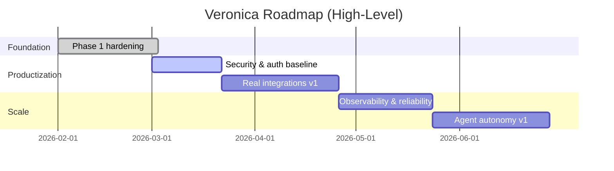

# Veronica Implementation Roadmap (Execution-Oriented)

This roadmap translates strategy into an implementation sequence suitable for a professional software lifecycle.

---

## 1) Delivery Strategy

---

## 2) Current Status (as of latest review)

## Completed
- [x] WebSocket chat endpoint with streaming responses.
- [x] Typed chat and voice API payload models.
- [x] Session-level in-memory state with pending-action support.
- [x] Confirmation gate (`confirm/cancel`) for sensitive actions.
- [x] Action audit trail (JSONL).
- [x] Blockchain balance read + transfer simulation primitives.
- [x] Baseline backend test suite for policy/session/protocol modules.
- [x] Phase 1 ADR and modular protocol/middleware foundation.

## In progress
- [ ] Full production hardening of auth, tenancy, and reliability controls.

## Not started
- [ ] Real connectors (calendar/email/home automation APIs).
- [ ] Secure signer abstraction for blockchain write actions.
- [ ] Deployment-grade observability and SLO-based operations.

---

## 3) Prioritized Backlog

## P0 — Must Have (production gate)
1. Authentication + authorization for HTTP and WebSocket routes.
2. Per-user tenancy boundaries for memory, session, and audit data.
3. Rate limiting and abuse controls.
4. Secret management and environment hardening.
5. Error taxonomy + centralized structured logging pipeline.

## P1 — High Value
1. Real email/calendar/home integrations with OAuth2.
2. UI support for confirmation cards and action previews.
3. Background workers for media and tool tasks.
4. Observability stack (metrics, tracing, dashboards, alerting).

## P2 — Strategic
1. Persona tuning controls and user preference center.
2. Multi-chain blockchain adapters and signer policy engine.
3. Proactive routines and autonomous task planner.

---

## 4) Phase-1 Detailed Checklist

## 4.1 Architecture and boundaries
- [x] Define ADR for Phase 1 hardening.
- [x] Introduce domain models (`ConversationContext`, `UserProfile`).
- [x] Separate websocket protocol handling from transport layer.
- [x] Add centralized middleware for request IDs and fallback 500 handling.

## 4.2 Quality gates
- [x] Add baseline unit tests for protocol handler.
- [x] Add baseline unit tests for middleware.
- [x] Add baseline tests for domain model validation.
- [x] Add repository guard test for unresolved merge markers.

## 4.3 Remaining gaps to close Phase 1 completely
- [ ] Introduce API auth dependency and security tests.
- [ ] Add contract tests for websocket events (`chunk/end/error/requires_confirmation`).
- [ ] Add lint/type-check pipelines in CI.

---

## 5) Definition of Done (DoD)

A milestone is complete only when:
1. Functional requirements are implemented.
2. Unit/integration tests pass in CI.
3. Security checks and static checks pass.
4. Documentation and ADRs are updated.
5. Operational runbook entries are present for any new subsystem.

---

## 6) Risk Register (Top Items)

1. **Security risk:** no auth/authz in current API surface.
2. **Operational risk:** local JSONL audit logging is not centralized/immutable.
3. **Scalability risk:** process-local session store is not shared across instances.
4. **Product risk:** tool integrations remain mostly simulated.
5. **Compliance risk:** voice/image data flows need explicit privacy controls.
