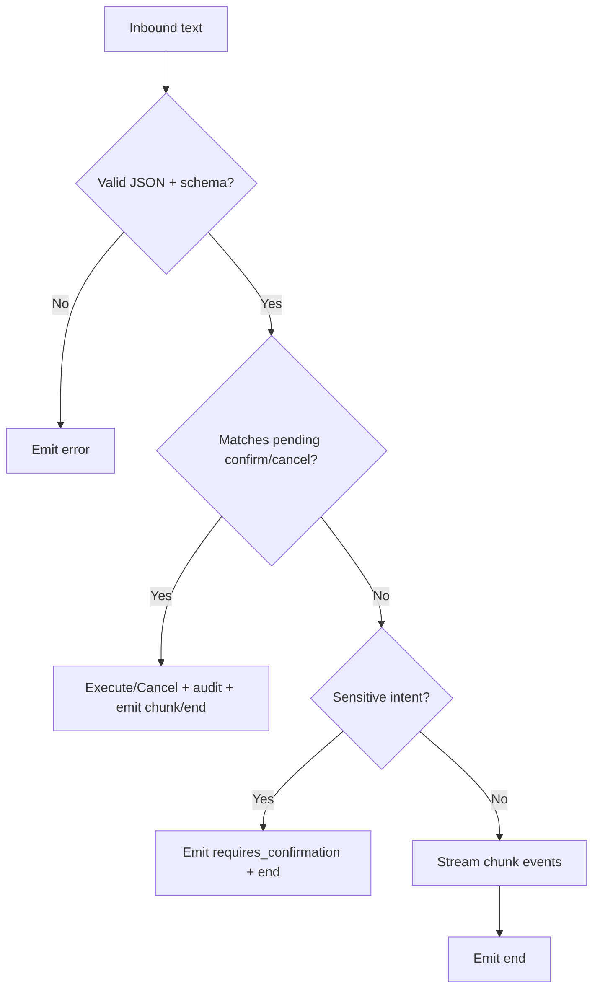

# Veronica API Contracts (Current)

This document summarizes the current backend contract surface for frontend and integration teams.

---

## 1) HTTP Endpoints

### `GET /`
Health-style status endpoint.

**Response**
```json
{
  "message": "Veronica AI Backend is running."
}
```

### `POST /voice/process`
Processes voice input from file path (prototype behavior).

**Request**
```json
{
  "audio_file_path": "path/to/audio.wav"
}
```

**Response**
```json
{
  "user_text": "transcribed text",
  "response_text": "assistant response",
  "audio_response": "<hex-encoded-bytes>"
}
```

**Errors**
- `400` when transcription fails.

---

## 2) WebSocket Contract

### Endpoint
`/ws/chat?session_id=<optional>`

If `session_id` is absent, server generates one internally.

### Inbound message
```json
{ "text": "user message" }
```

### Outbound message types

#### `chunk`
```json
{ "type": "chunk", "text": "partial response" }
```

#### `end`
```json
{ "type": "end" }
```

#### `error`
```json
{ "type": "error", "message": "validation or parse error" }
```

#### `requires_confirmation`
```json
{
  "type": "requires_confirmation",
  "action_id": "uuid",
  "message": "Reply confirm/cancel..."
}
```

---

## 3) Confirmation Protocol

- Server may return `requires_confirmation` for sensitive actions.
- User must send one of:
  - `confirm <action_id>`
  - `cancel <action_id>`

On success, server emits a normal chat response flow (`chunk` + `end`) and logs audit event.

---

## 4) Event Flow Diagram



---

## 5) Planned Contract Changes

1. Add auth headers/token requirements for all routes.
2. Add websocket versioned event envelope (`version`, `request_id`, `timestamp`).
3. Migrate `voice/process` to multipart upload contract.
4. Add explicit error codes in websocket `error` payload.
