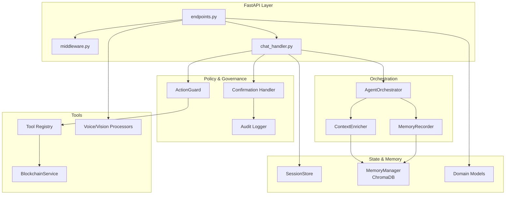
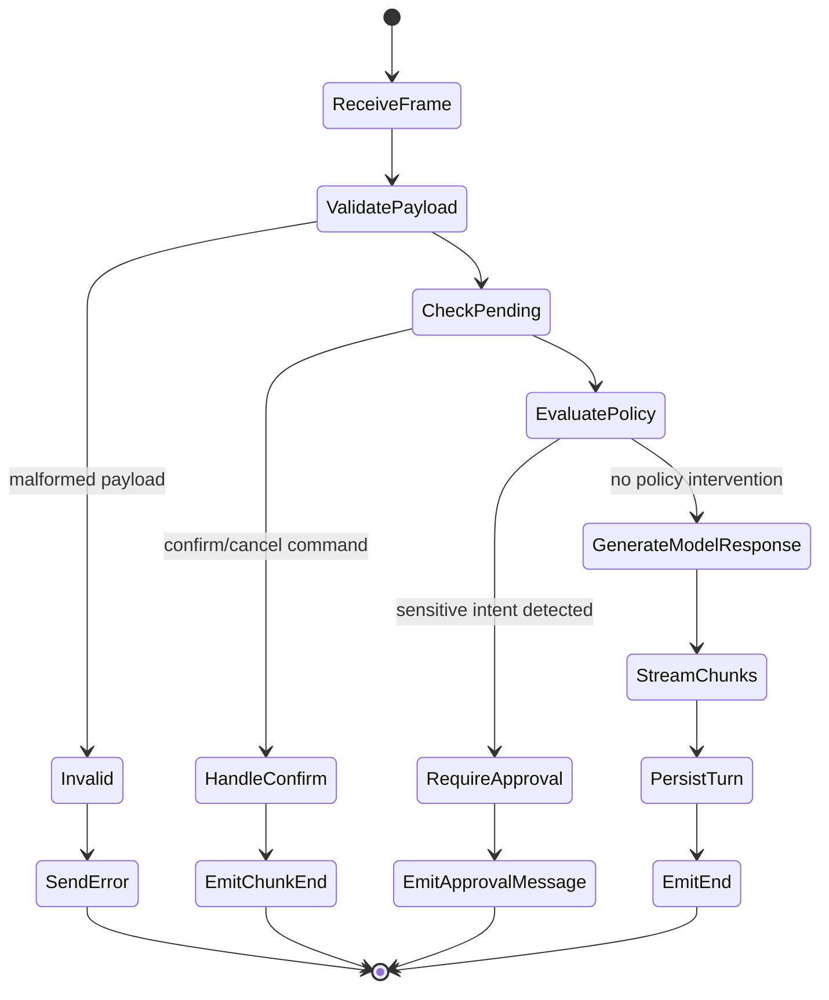
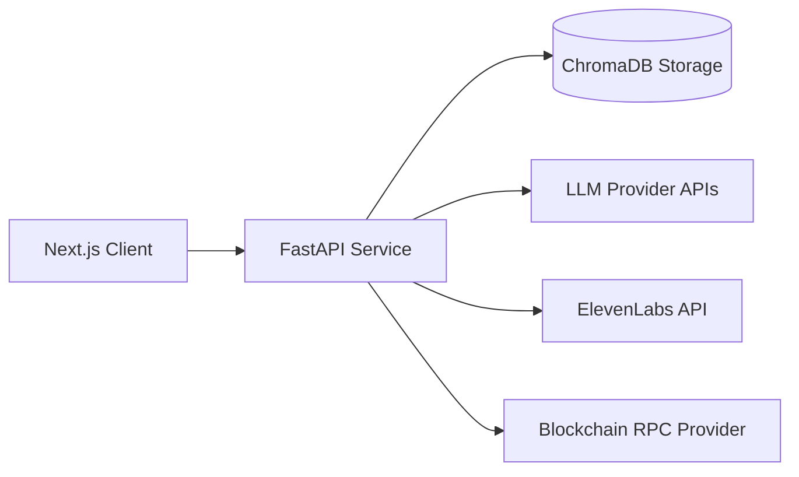

# Veronica Architecture Deep Dive

This document provides a technical architecture overview of the current backend/frontend implementation and the intended evolution path.

---

## 1) Architectural Principles

1. **Safety first:** side-effectful actions require explicit user confirmation.
2. **Modularity:** orchestration, protocol handling, policy, and tools remain separable.
3. **Observability-ready:** request IDs and explicit audit events support traceability.
4. **Evolvability:** domain model introduction enables personalization and multi-tenant extensions.

---

## 2) Backend Component Map

---

## 3) Conversation Lifecycle

---

## 4) Data and State Boundaries

## Session state (process-local)
- Conversation history for each websocket session.
- Optional pending action for confirmation flow.

## Long-term memory (vector DB)
- Persistent memory snippets queried for context enrichment.
- Current implementation is global, to be upgraded to tenant-scoped namespaces.

## Audit trail
- Local JSONL records of confirmed/cancelled sensitive actions.
- Planned evolution: centralized append-only audit sink.

---

## 5) Deployment Perspective

### Production recommendations
- Place API behind reverse proxy with TLS termination.
- Externalize session state to Redis (or equivalent) before horizontal scaling.
- Use managed secret store for API keys.
- Add OpenTelemetry for traces and metrics.

---

## 6) Known Design Trade-offs

1. **Regex-based policy detection** is simple but brittle for natural language variance.
2. **Process-local session state** is fast for prototype but not multi-instance safe.
3. **Simulation-based tools** reduce risk during development but limit real-world utility.
4. **Single-service architecture** simplifies early velocity but constrains independent scaling.
